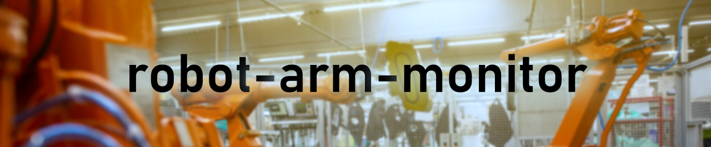
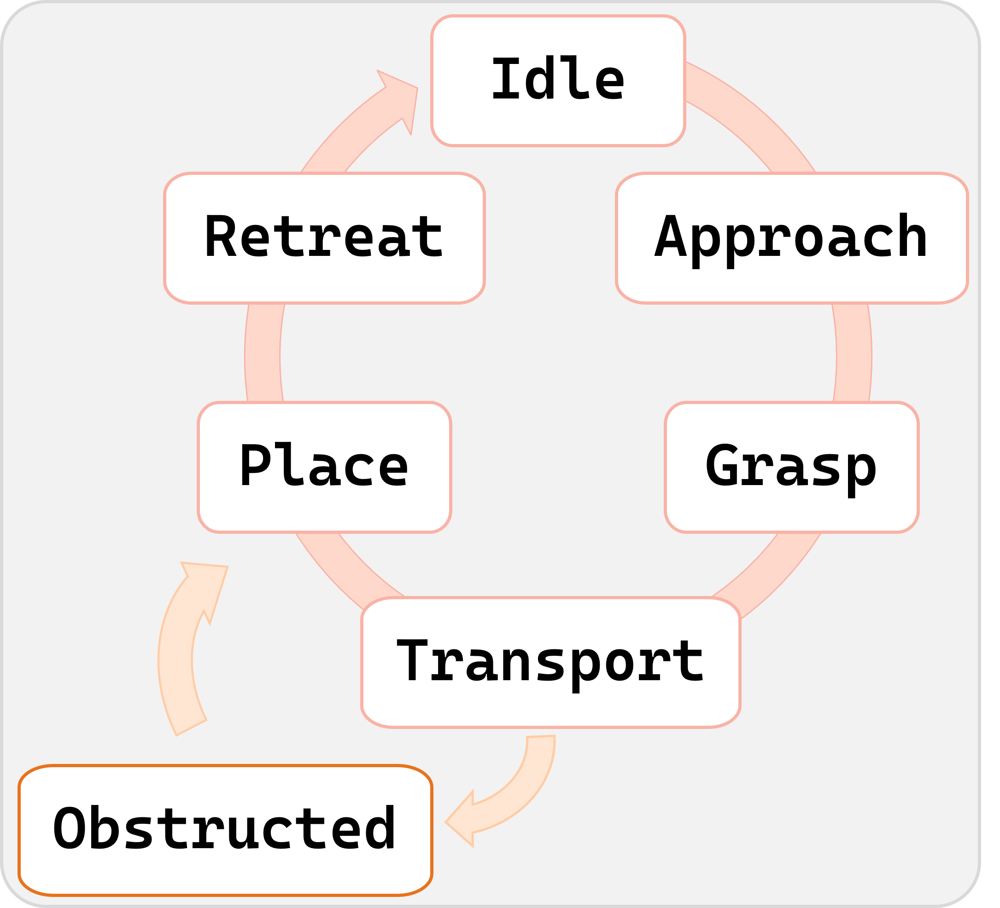
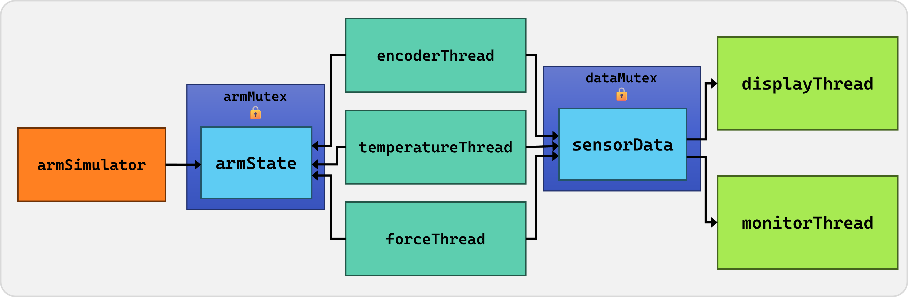
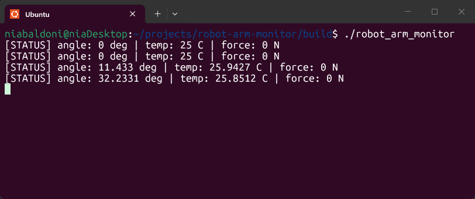

<div align="center">

[](https://github.com/niaBaldoni/robot-arm-monitor/actions/workflows/ci.yml)   [](https://github.com/niaBaldoni/robot-arm-monitor/blob/main/LICENSE)

</div>

---

A multithreaded C++ safety monitor for a simulated robot arm, with concurrent sensor reading and real-time hazard detection on Linux.


## Why it exists 

This project is a small but real multithreaded system: sensor threads write concurrently to shared memory, and a monitor thread reasons about combinations of sensor data in real time to detect dangerous conditions. This is a pattern that shows up often in robotics and safety-critical systems, and since I'm moving toward embedded and systems-level work, I decided to build something that gives me hands-on experience with C++ on Linux, concurrency, and embedded-adjacent systems programming.

v0.2 introduces a physics-based simulation instead of random drift, which makes the monitor's job meaningful, rather than threshold-checking noise.


## Architecture

### Simulator

Compared to v0.1, this version implements a state machine cycling through `Idle → Approach → Grasp → Traspost → Place → Retreat`, with a chance of entering an `Obstructed` state during `Transport`.

<div style="text-align: center"></div>

### robot-arm-monitor

The system runs six threads:
- `armSimulatorThread` updates a ground-truth physics model `ArmState` every 10ms;
- `encoderThread`, `temperatureThread` and `forceThread` each sample `ArmState` and write their respective values into the shared struct `sensorData`
- `displayThread` reads `sensorData` once per second and prints a status line
- `monitorThread` reads `sensorData`, evaluates danger conditions, and prints alerts



Two mutexes protect shared state. `armMutex` guards `ArmState` but is never exposed directly: sensor threads access it only through `getArmStateSnapshot()`, which locks, copies, and releases before returning. `dataMutex` guards `sensorData`. Because no thread ever holds both mutexes at once, deadlock is structurally impossible rather than something enforced by convention.


## Demo

The arm and the console during normal operations:



The arm and the console if the arm enters the "Obstructed" state:


## How to build and run

You will need to have `cmake`, `build-essential`, and `libgtest-dev` installed.

```bash
sudo apt install cmake
sudo apt install build-essential
sudo apt install libgtest-dev
```

To see the project in action, clone the repo, navigate to your repo folder, then execute these commands:

```bash
mkdir build
cd build
cmake ..
make
./robot_arm_monitor
```


## Testing

Unit tests cover sensor value validation, including verifying that the force sensor never returns negative values and that the encoder correctly wraps at 360 degrees. Tests run automatically via GitHub Actions on every push to `main`.

To run them locally:

```bash
cd build
ctest
```


## Roadmap

- Add hysteresis to alerts: a higher threshold to trigger, a lower one to clear, to prevent repeated alerts from noise near the boundary
- Track sensor readings over time so `monitorThread` can detect dangerous trends, not just instantaneous threshold violations
- Promote `monitorThread` to a closed-loop safety controller: detect sustained anomalies, issue recovery commands through a controlled interface on the simulator, verify the system returned to normal operating parameters
- Implement a jerk-limited force model so force ramps smoothly through state transitions instead of snapping between 0 and 60N
- Improve post-obstruction recovery so the arm resumes and completes its interrupted task rather than jumping directly to the next phase
- Replace the coarse-grained struct lock with fine-grained per-field locking or `std::atomic<float>`, allowing sensors to write concurrently without contention

---
Photo by [Simon Kadula](https://unsplash.com/photos/a-factory-filled-with-lots-of-orange-machines-8gr6bObQLOI) on [Unsplash](https://unsplash.com).