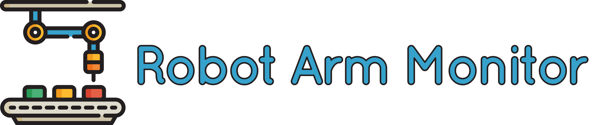

<div align="center">



[](https://github.com/niaBaldoni/robot-arm-monitor/actions/workflows/ci.yml) 
 
 
[](https://github.com/niaBaldoni/robot-arm-monitor/blob/main/LICENSE)

</div>

---

A multithreaded C++ safety monitor for a simulated robot arm, with concurrent sensor reading and real-time hazard detection on Linux.


## Why it exists 

This project is a small multithreaded system: sensor threads write concurrently to shared memory, and a monitor thread reasons about combinations of sensor data in real time to detect dangerous conditions. Since I'm moving toward embedded and systems-level work, I decided to build something that gives me hands-on experience with C++ on Linux, concurrency, and embedded-adjacent systems programming.

v0.3 focuses on code correctness and modernization: defensive coding across the state machine, explicit failure on invalid states, and migration to C++20 features


## Architecture

### Robot Arm Simulator

v0.2 added a state machine cycling through `Idle → Approach → Grasp → Traspost → Place → Retreat` to simulate a robot arm. There is a chance of entering an `Obstructed` state during `Transport`.

<div style="text-align: center"></div>

### Robot Arm Monitor

The system runs six threads in total: `armSimulatorThread`, the three sensors `encoderThread`, `temperatureThread` and `forceThread`, and the two monitors `displayThread` and `monitorThread`.


Two mutexes protect shared state. 

`armMutex` guards `ArmState` but is never exposed directly: sensor threads access it only through `getArmStateSnapshot()`, which locks, copies, and releases before returning; `dataMutex` guards `sensorData`. 

Because no thread can ever hold both mutexes at once, deadlock is structurally impossible.


## Demo

The arm and the console during normal operations:


The arm and the console if the arm enters the "Obstructed" state:


## How to build and run

You will need to have `cmake`, `build-essential`, and `libgtest-dev` installed.

```bash
sudo apt install cmake
sudo apt install build-essential
sudo apt install libgtest-dev
```

To see the project in action, clone the repo, navigate to your repo folder, then execute these commands:

```bash
mkdir build
cd build
cmake ..
make
./robot_arm_monitor
```


## Testing

Unit tests cover sensor value validation, including verifying that the force sensor never returns negative values and that the encoder correctly wraps at 360 degrees. Tests run automatically via GitHub Actions on every push to `main`.

To run them locally:

```bash
cd build
ctest
```


## Roadmap

- The Big Refactor™
- Add hysteresis to alerts: a higher threshold to trigger, a lower one to clear, to prevent repeated alerts from values going just above and below the hard boundary
- Track sensor readings over time so that `monitorThread` can detect dangerous trends, not just instantaneous threshold violations
- Implement a jerk-limited force model so force ramps smoothly through state transitions instead of snapping between 0 and 60N
- Improve post-obstruction recovery so the arm resumes and completes its interrupted task rather than jumping directly to the next phase

---