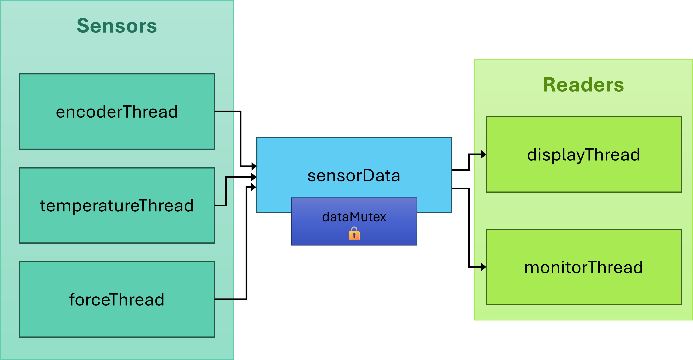
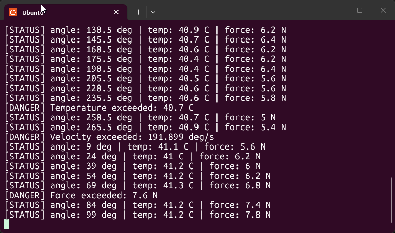
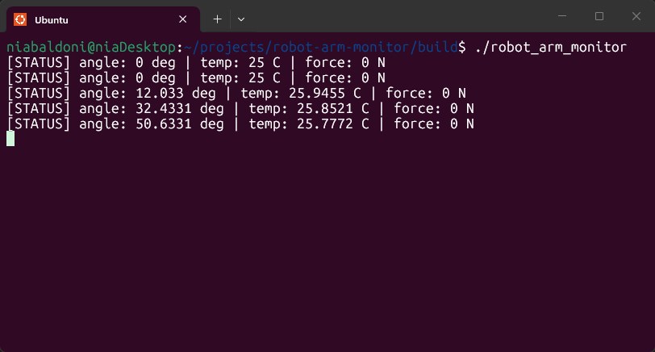

<div align="center">

[](https://github.com/niaBaldoni/robot-arm-monitor/actions/workflows/ci.yml)   [](https://github.com/niaBaldoni/robot-arm-monitor/blob/main/LICENSE)

</div>

---

A multithreaded C++ safety monitor for a simulated robot arm, with concurrent sensor reading and real-time hazard detection on Linux.


## Why it exists 

This project is a small but real multithreaded system: sensor threads write concurrently to shared memory, and a monitor thread reasons about combinations of sensor data in real time to detect dangerous conditions. This is a pattern that shows up often in robotics and safety-critical systems, and since I'm moving toward embedded and systems-level work, I decided to build something that gives me hands-on experience with C++ on Linux, concurrency, and embedded-adjacent systems programming.

v0.2 introduces a physics-based simulation instead of random drift, which makes the monitor's job meaningful, rather than threshold-checking noise.


## Architecture

We have five total threads:

- `encoderThread`, `temperatureThread` and `forceThread` write their values to the shared struct `sensorData`
- `displayThread` reads the shared struct and prints a status line once a second
- `monitorThread` reads the shared struct, evaluates danger conditions, prints alerts



The shared struct `sensorData` is protected by one mutex, `dataMutex`. When `monitorThread` locks `dataMutex` and reads `angle`, `temperature`, and `force` together, it is guaranteed that none of those values can change mid-read: it gets a fully consistent snapshot of all three at once. This project is focused on catching combinations of dangerous values, so we need them to be consistent at the same instant.


## Demo

The console during normal operations:



The console and warning systems if the arm enters the "Obstructed" state:



## How to build and run

You will need to have `cmake`, `build-essential`, and `libgtest-dev` installed.

```bash
sudo apt install cmake
sudo apt install build-essential
sudo apt install libgtest-dev
```

To see the project in action, clone the repo, navigate to your repo folder, then execute these commands:

```bash
mkdir build
cd build
cmake ..
make
./robot_arm_monitor
```


## Testing

Unit tests cover sensor value validation, including verifying that the force sensor never returns negative values and that the encoder correctly wraps at 360 degrees. Tests run automatically via GitHub Actions on every push to `main`.

To run them locally:

```bash
cd build
ctest
```


## Roadmap

- Replace the coarse-grained struct lock with fine-grained per-field locking or `std::atomic<float>`, allowing sensors to write concurrently without contention
- Track sensor readings over time so `monitorThread` can detect dangerous trends, not just instantaneous threshold violations
- Add hysteresis to alerts: a higher threshold to trigger, a lower one to clear, to prevent repeated alerts from noise near the boundary
- Improve sensor simulation to better reflect plausible physical behavior of a real robot arm

---
Photo by [Simon Kadula](https://unsplash.com/photos/a-factory-filled-with-lots-of-orange-machines-8gr6bObQLOI) on [Unsplash](https://unsplash.com).